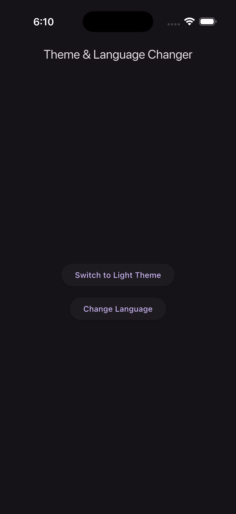
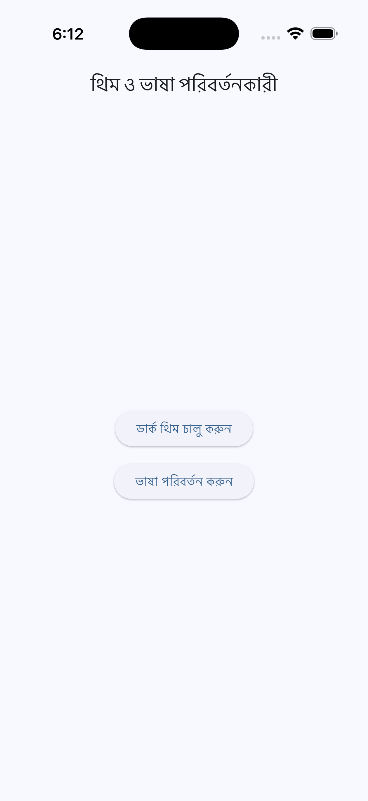

# 🌗 Theme & Language Changer App

A clean, modern **Flutter** app built using **Riverpod**, **Material 3**, and **Flutter Localization** (`gen-l10n`).  
It demonstrates how to switch between **Light/Dark themes** and **multiple languages (English 🇬🇧 & Bangla 🇧🇩)** dynamically —  
with user preferences **persisted using `shared_preferences`**.

---

## 📱 Screenshots

| Dark Mode | Light Mode |
|------------|-------------|
|  |  |

---

## 🚀 Features

✅ Dynamic **theme switching** (Light / Dark)  
✅ **System theme detection** on first launch  
✅ Persistent theme choice using **SharedPreferences**  
✅ Dynamic **language switching** (`en` / `bn`)  
✅ Persistent locale using **SharedPreferences**  
✅ Flutter **`gen-l10n`** with `.arb` localization files  
✅ **BuildContext extension** for easy access:
```dart
Text(context.locale.changeLanguage)
```

✅ Clean, scalable folder architecture
✅ Built with Riverpod (no BuildContext dependencies in state logic)


🧱 Folder Structure

```bash
lib/
├── application/
│   └── localization/
│       ├── gen/                      # Generated l10n files (AppLocalizations)
│       ├── localization_extension.dart
│       ├── locale_notifier.dart
│       └── locale_provider.dart
│
├── core/
│   └── theme/
│       ├── app_theme.dart
│       ├── theme_notifier.dart
│       └── theme_provider.dart
│
├── features/
│   └── home/
│       └── presentation/
│           └── home_screen.dart
│
├── l10n/
│   ├── app_en.arb
│   └── app_bn.arb
│
└── main.dart
```

### Theme and Language Toggle Buttons

The app includes two buttons on the UI to allow users to easily switch the theme and language.

1. Theme Toggle Button

```bash
ElevatedButton(
  onPressed: () async {
    await ref.read(themeNotifierProvier.notifier).toggleTheme();
  },
  child: Text(
    themeMode == ThemeMode.light
        ? context.locale.switchToDark
        : context.locale.switchToLight,
  ),
),
```
- Purpose: Switches the app between light mode and dark mode.
### How it works: 
 - It uses the themeNotifierProvider to manage the app’s theme state.
 - When pressed, it calls toggleTheme(), which switches between ThemeMode.light and ThemeMode.dark.
 - The button text dynamically updates based on the current theme, showing either "Switch to Dark" or "Switch to Light".


2. Language Toggle Button
```bash
ElevatedButton(
  onPressed: () async {
    await ref.read(localeNotifierProvider.notifier).toggleLocale();
  },
  child: Text(context.locale.changeLanguage),
),
```
- Purpose: Switches the app’s language dynamically.
### How it works: 
- It uses the localeNotifierProvider to manage the app’s locale (language) state.
- When pressed, it calls toggleLocale(), which changes the app’s language (for example, from English to another supported language).
- The button text always shows "Change Language" in the current locale.

### Summary:
- The first button toggles between light and dark theme.
- The second button toggles the app’s language.
- Both buttons use Riverpod state management to update the UI immediately when pressed.